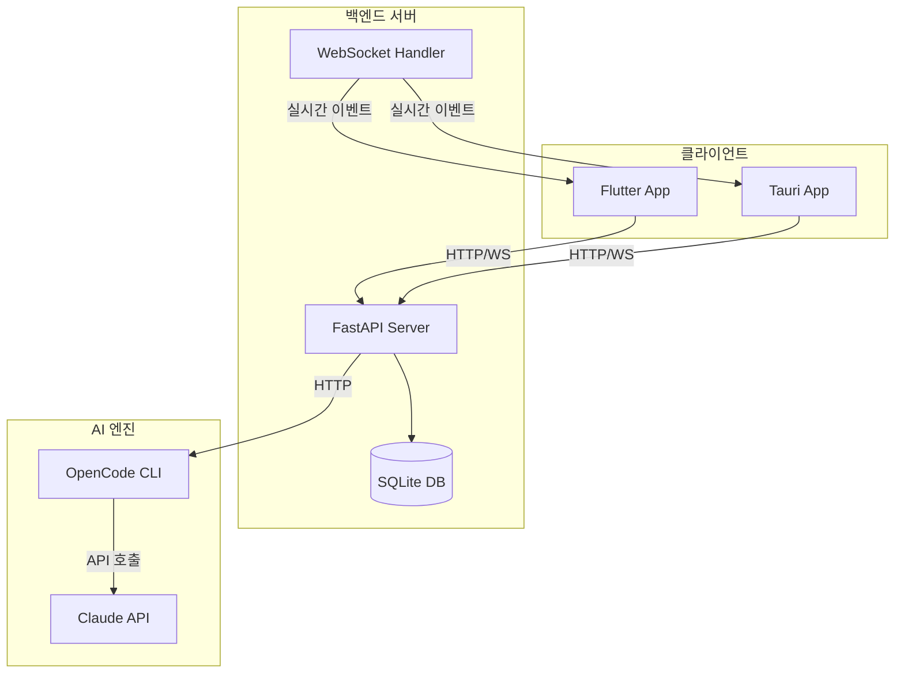
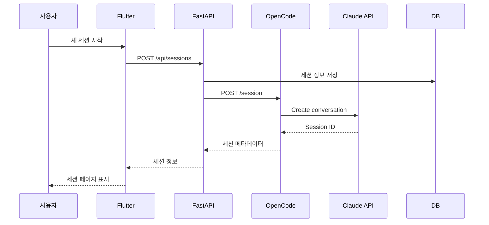
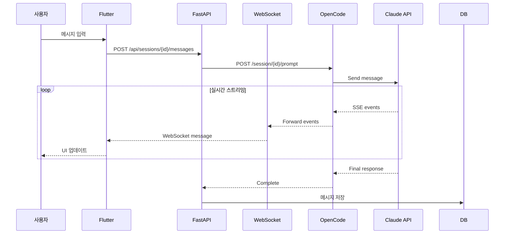
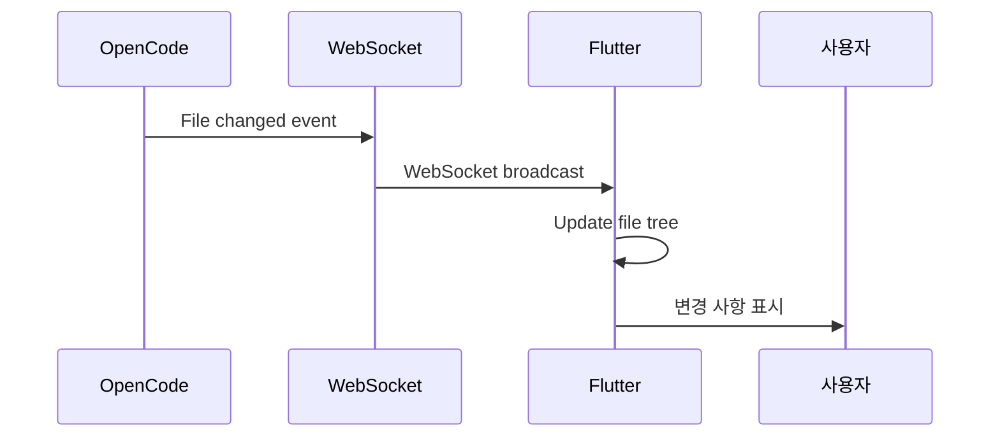
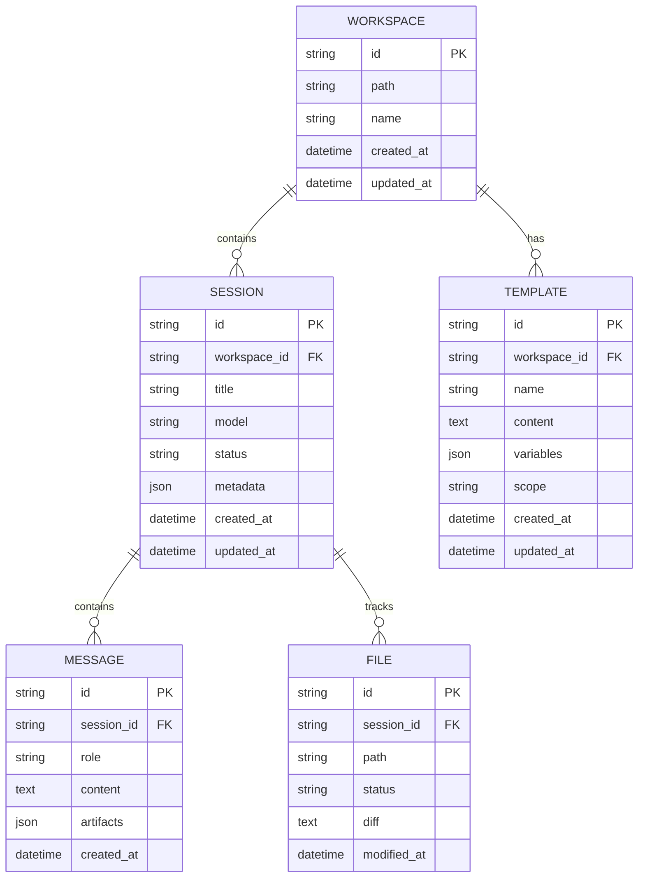

# 시스템 아키텍처

OpenWork는 AI 기반 코딩 어시스턴트인 OpenCode를 위한 GUI 프론트엔드입니다. 이 문서는 시스템의 전체 아키텍처와 주요 컴포넌트를 설명합니다.

## 목차

- [개요](#개요)
- [시스템 구성도](#시스템-구성도)
- [컴포넌트 설명](#컴포넌트-설명)
- [데이터 플로우](#데이터-플로우)
- [상태 관리](#상태-관리)
- [실시간 통신](#실시간-통신)
- [데이터베이스 스키마](#데이터베이스-스키마)

## 개요

OpenWork는 3-tier 아키텍처를 기반으로 합니다:

```
┌─────────────────┐
│  Presentation   │  Flutter (크로스 플랫폼)
│      Layer      │  또는 Tauri + React
└────────┬────────┘
         │ HTTP/WebSocket
┌────────┴────────┐
│   Application   │  FastAPI (Python)
│      Layer      │  비즈니스 로직 & API
└────────┬────────┘
         │ HTTP/IPC
┌────────┴────────┐
│   Integration   │  OpenCode CLI
│      Layer      │  AI 엔진
└─────────────────┘
```

## 시스템 구성도

### 고수준 아키텍처



### 컴포넌트 간 통신

- **Flutter ↔ FastAPI**: REST API (HTTP) + WebSocket
- **Tauri ↔ FastAPI**: REST API (HTTP) + WebSocket
- **FastAPI ↔ OpenCode**: HTTP API 또는 IPC
- **OpenCode ↔ Claude**: Anthropic API (HTTPS)

## 컴포넌트 설명

### 1. 프론트엔드 (Presentation Layer)

#### Flutter 앱 (`openwork-flutter`)

**기술 스택**:
- **프레임워크**: Flutter 3.16+
- **상태 관리**: Riverpod 2.0
- **라우팅**: go_router
- **HTTP 클라이언트**: dio
- **WebSocket**: web_socket_channel

**주요 기능**:
- 세션 관리 UI
- 채팅 인터페이스
- 파일 뷰어
- 템플릿 관리
- 설정 페이지

**디렉토리 구조**:
```
lib/
├── core/              # 공통 유틸리티
│   ├── config/
│   ├── theme/
│   └── utils/
├── features/          # 기능별 모듈
│   ├── session/
│   ├── template/
│   ├── workspace/
│   └── settings/
├── providers/         # Riverpod 프로바이더
├── models/           # 데이터 모델
├── services/         # API 클라이언트
└── widgets/          # 공통 위젯
```

#### Tauri 앱 (`openwork-clone`)

**기술 스택**:
- **프레임워크**: React 18 + TypeScript
- **상태 관리**: Zustand
- **UI 라이브러리**: Radix UI
- **스타일링**: Tailwind CSS
- **데스크톱**: Tauri 1.5

**용도**: 레퍼런스 구현 (기능 검증용)

### 2. 백엔드 (Application Layer)

#### FastAPI 서버 (`openwork-python`)

**기술 스택**:
- **프레임워크**: FastAPI 0.109+
- **ASGI 서버**: Uvicorn
- **ORM**: SQLAlchemy 2.0
- **마이그레이션**: Alembic
- **검증**: Pydantic 2.0

**주요 책임**:
- REST API 제공
- WebSocket 연결 관리
- 세션 상태 관리
- 데이터베이스 CRUD
- OpenCode CLI 통합

**디렉토리 구조**:
```
app/
├── api/              # API 엔드포인트
│   ├── endpoints/    # 라우터 정의
│   │   ├── sessions.py
│   │   ├── templates.py
│   │   ├── skills.py
│   │   └── workspaces.py
│   └── websocket.py  # WebSocket 핸들러
├── core/             # 핵심 설정
│   ├── config.py     # 환경 설정
│   └── security.py   # 보안 관련
├── db/               # 데이터베이스
│   ├── database.py   # DB 연결
│   └── migrations/   # Alembic 마이그레이션
├── models/           # SQLAlchemy 모델
│   ├── session.py
│   ├── template.py
│   └── workspace.py
├── schemas/          # Pydantic 스키마
│   ├── session.py
│   └── template.py
├── services/         # 비즈니스 로직
│   ├── opencode_client.py
│   └── session_service.py
└── main.py          # 애플리케이션 진입점
```

### 3. AI 엔진 (Integration Layer)

#### OpenCode CLI

**통합 방식**:
1. **HTTP API 모드** (권장):
   ```bash
   opencode --api --port 8080
   ```

2. **IPC 모드** (향후):
   - 프로세스 간 통신
   - 더 낮은 레이턴시

**주요 기능**:
- 세션 생성 및 관리
- 프롬프트 처리
- 파일 시스템 권한 관리
- MCP 서버 통합
- 스킬 실행

## 데이터 플로우

### 1. 세션 생성 플로우



### 2. 프롬프트 처리 플로우



### 3. 파일 변경 알림 플로우



## 상태 관리

### Flutter (Riverpod)

```dart
// 세션 상태
@riverpod
class SessionNotifier extends _$SessionNotifier {
  @override
  AsyncValue<Session?> build(String sessionId) {
    return const AsyncValue.loading();
  }

  Future<void> sendMessage(String content) async {
    // 낙관적 업데이트
    state = AsyncValue.data(
      state.value?.copyWith(
        messages: [...state.value!.messages, Message(content: content)],
      ),
    );

    try {
      await ref.read(apiClientProvider).sendMessage(sessionId, content);
    } catch (e) {
      // 에러 시 롤백
      state = AsyncValue.error(e, StackTrace.current);
    }
  }
}

// WebSocket 연결
@riverpod
Stream<Event> sessionEvents(SessionEventsRef ref, String sessionId) {
  final wsUrl = 'ws://localhost:8000/ws/session/$sessionId';
  final channel = WebSocketChannel.connect(Uri.parse(wsUrl));

  return channel.stream.map((data) => Event.fromJson(jsonDecode(data)));
}
```

### 상태 흐름

```
User Action → Provider → Service → API → Backend
                ↓
              State Update
                ↓
            Widget Rebuild
```

## 실시간 통신

### WebSocket 이벤트 타입

```python
# 백엔드 이벤트 정의
class EventType(str, Enum):
    MESSAGE_START = "message_start"
    MESSAGE_DELTA = "message_delta"
    MESSAGE_END = "message_end"
    FILE_CHANGED = "file_changed"
    TOOL_USE = "tool_use"
    ERROR = "error"

class Event(BaseModel):
    type: EventType
    data: dict[str, Any]
    timestamp: datetime
```

### WebSocket 핸들러 구현

```python
# app/api/websocket.py
from fastapi import WebSocket, WebSocketDisconnect

class ConnectionManager:
    def __init__(self):
        self.active_connections: dict[str, list[WebSocket]] = {}

    async def connect(self, websocket: WebSocket, session_id: str):
        await websocket.accept()
        if session_id not in self.active_connections:
            self.active_connections[session_id] = []
        self.active_connections[session_id].append(websocket)

    async def broadcast(self, session_id: str, message: dict):
        if session_id in self.active_connections:
            for connection in self.active_connections[session_id]:
                await connection.send_json(message)

manager = ConnectionManager()

@app.websocket("/ws/session/{session_id}")
async def websocket_endpoint(websocket: WebSocket, session_id: str):
    await manager.connect(websocket, session_id)
    try:
        while True:
            # Keep connection alive
            await websocket.receive_text()
    except WebSocketDisconnect:
        manager.disconnect(websocket, session_id)
```

## 데이터베이스 스키마

### ERD (Entity Relationship Diagram)



### SQLAlchemy 모델 예시

```python
# app/models/session.py
from sqlalchemy import Column, String, DateTime, Text, JSON, ForeignKey
from sqlalchemy.orm import relationship
from datetime import datetime
from app.db.database import Base

class Session(Base):
    __tablename__ = "sessions"

    id = Column(String(36), primary_key=True)
    workspace_id = Column(String(36), ForeignKey("workspaces.id"))
    title = Column(String(255), nullable=False)
    model = Column(String(100), nullable=True)
    status = Column(String(50), default="active")
    metadata = Column(JSON, nullable=True)
    created_at = Column(DateTime, default=datetime.utcnow)
    updated_at = Column(DateTime, default=datetime.utcnow, onupdate=datetime.utcnow)

    # Relationships
    workspace = relationship("Workspace", back_populates="sessions")
    messages = relationship("Message", back_populates="session", cascade="all, delete")
    files = relationship("File", back_populates="session", cascade="all, delete")
```

## 보안 고려사항

### 1. 인증 (향후 구현)

- JWT 기반 인증
- OAuth 2.0 (선택사항)
- API 키 관리

### 2. 권한 관리

- 파일 시스템 접근 제어
- 명령 실행 권한
- MCP 서버 연결 승인

### 3. 데이터 보호

- 민감 정보 암호화 (API 키 등)
- HTTPS 강제
- CORS 설정

## 확장성 고려사항

### 수평 확장

```
┌─────────┐
│ Client  │
└────┬────┘
     │
┌────┴────┐
│  LB     │  (Nginx/Traefik)
└────┬────┘
     │
  ┌──┴──┬──────┐
  │     │      │
┌─┴─┐ ┌─┴─┐  ┌─┴─┐
│API│ │API│  │API│  (FastAPI 인스턴스)
└─┬─┘ └─┬─┘  └─┬─┘
  │     │      │
  └─────┴──────┘
        │
   ┌────┴────┐
   │ Redis   │  (세션 공유)
   └─────────┘
```

### 데이터베이스 확장

- **개발**: SQLite
- **프로덕션**: PostgreSQL + 연결 풀링
- **캐싱**: Redis (세션, 자주 조회되는 데이터)

## 모니터링 및 로깅

### 로깅 구조

```python
# 구조화된 로깅
import structlog

logger = structlog.get_logger()

logger.info(
    "session_created",
    session_id=session.id,
    workspace=session.workspace_id,
    model=session.model,
)
```

### 메트릭 수집 (향후)

- Prometheus + Grafana
- 주요 메트릭:
  - API 응답 시간
  - WebSocket 연결 수
  - OpenCode 호출 성공률
  - 에러율

## 참고 자료

- [FastAPI 공식 문서](https://fastapi.tiangolo.com/)
- [Flutter 아키텍처 가이드](https://docs.flutter.dev/app-architecture)
- [Riverpod 문서](https://riverpod.dev/)
- [OpenCode 문서](https://github.com/anthropics/claude-code)
